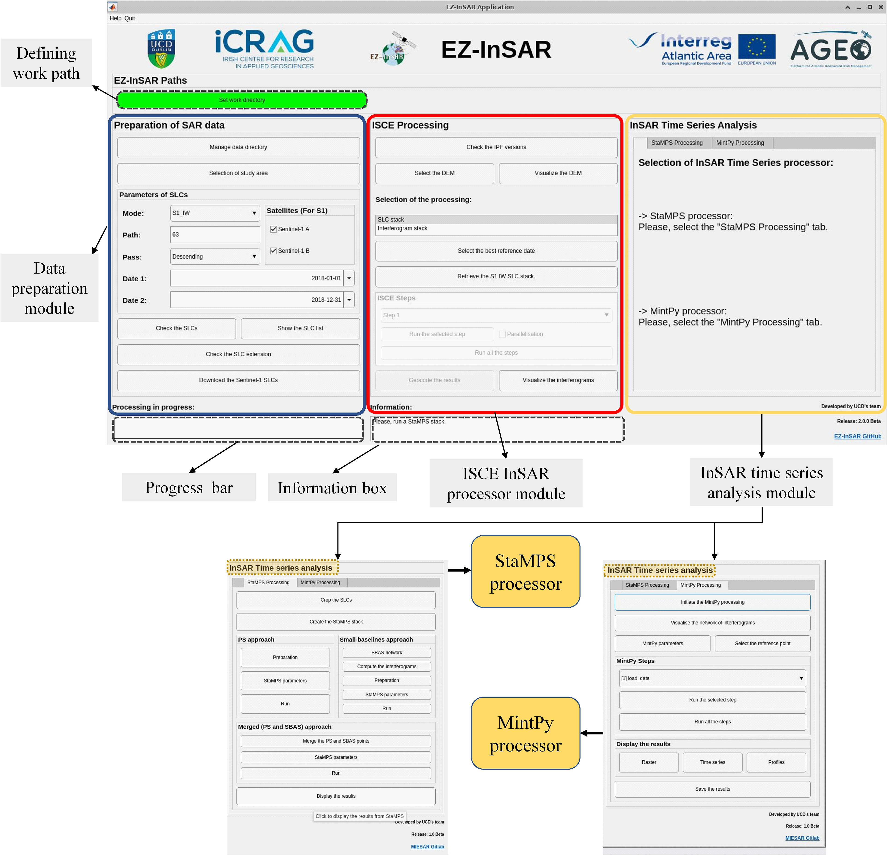

 

# EZ-InSAR 

**EZ-InSAR (formerly called MIESAR for Matlab Interface for Easy InSAR)** is a toolbox written in MATLAB to conduct Interferometric Synthetic Aperture Radar (InSAR) data processing using the open-source software packages (ISCE+StaMPS/MintPy) within a easy-to-use Graphic-User-Interface (GUI). The toolbox now can generate SAR interferograms using ISCE and conduct displacement time series analysis with either Persistent Scatters (**PS**) or Small-Baselines (**SBAS**) approaches using StaMPS or MintPy. 

**EZ-InSAR** minimizes the work of user in downloading, parametrizing, and processing the SAR data, so enabling these who are not familiar with InSAR but can also produce and analyze ground surface displacements by themselves. **EZ-InSAR** is also a contribution to the Platform for Atlantic Geohazard Risk Management (AGEO) project, which is funded by Interreg Atlantic Area Programme through the *European* Regional Development Fund.

**If you have any questions or problems, please feel free to use the *Discussions* section.**

**Release info**: Version 2.1.0 Beta, September, 2023

**Sensors:**
| Satellite | Mode | EZ-InSAR | SLC format |
|---|---|---|---|
|Sentinel-1|IW|Ready|.zip or .SAFE in the slc directory|
|Sentinel-1|Stripmap|Ready|.zip or .SAFE in the slc directory|
|TerraSAR-X or PAZ|StripMap|Ready|Unzipped PAZ1_* or TSX1_* directory in the slc directory|
|Cosmo-SkyMed|Stripmap|Ready|[directory of the acquisition]/CSK*.h5 in the slc directory|
|ALOS2|StripMap|No|NE|

Please note that the processing with the Stripmap data (other than Sentinel-1) has not been fully tested: only the data preparation has been tested. However, the InSAR processors are compatible with these data. For the Spotlight data, EZ-InSAR can manage the data similar to StripMap but the processing with ISCE should be modified. 

Please check the guidelines to add a new sensor: [here](https://github.com/alexisInSAR/EZ-InSAR/blob/Version_2_0_3_Beta/EZINSAR_BIN/docs/guide_new_sensors.md). 

## 1. Dependencies & Installation 

See [**Installation**](./EZINSAR_BIN/docs/EZ-InSAR_tutorial-Part-II.md) to install and configure the depended codes and software. 

**EZ-InSAR** incorporates several the most popular open source InSAR processors to perform SAR interferometry and displacement time series analysis, under MATLAB (>2020b). These processors are: 

·         **[ISCE](https://github.com/isce-framework/isce2)** - Interferometric synthetic aperture radar Scientific Computing Environment (ISCE)

·         **[StaMPS](https://homepages.see.leeds.ac.uk/~earahoo/stamps/)** - Stanford Method for Persistent Scatterers (StaMPS)

·         **[MintPy](https://github.com/insarlab/MintPy)** - The Miami INsar Time-series software in PYthon (MintPY)

Some additional dependencies are needed to run the above InSAR processors or enhancing the functions of the code. For example, you may need the TRAIN package to correct for tropospheric errors in SAR interferograms when using StaMPS, and in MintPy you may need PyAPS to do the similar work. Some toolboxes of MATLAB are also needed for successfully running the SAR processing code, which will be descripted in detail in **Part II** of the help document. 

**EZ-InSAR** is developed on a Linux platform currently. The commercial software MATLAB is needed to run **EZ-InSAR**. 

## 1.2 Running the toolbox 

After the installation and configuration, open a terminal, load the EZ-InSAR environment with the "load_insar" command, launch "Matlab", and then type "EZ_InSAR". 

​																						   **Figure 1.** The snapshot of the interface of EZ-InSAR.

Basically, the interface contains three independent modules shown as the "Data preparation module", "ISCE InSAR processing module", and "InSAR time series analysis module". The “EZ-InSAR Paths” button allows the user to define the work path for processing the data. The StaMPS and MintPy processors can be activated by clicking the corresponding tables in the "InSAR time series analysis module" module, respectively. Also, there is a progress bar showing the running progress of each step and an information box showing the useful tip during data processing at the bottom of the interface. 

A **tutorial** on the use of the toolbox can be downloaded from [**here**](./EZINSAR_BIN/docs/EZ_InSAR_manual_v2_0_2_beta.pdf).

## 1.3 Developers & Contact

Based on original idea and development from Alexis Hrysiewicz, EZ-InSAR is developed and maintained by the **Natural Geohazard Research** group lead by **[Eoghan Holohan](https://people.ucd.ie/eoghan.holohan)** at School of Earth Sciences, ***University College Dublin*** (UCD). The people who develop and document the toolbox are acknowledged below: 

- *Alexis Hrysiewicz,* 
  
  Postdoctoral Researcher, UCD School of Earth Sciences, University College Dublin
  
  Email: alexis.hrysiewicz@ucd.ie 

- *Xiaowen Wang*

  Research Scientist, UCD School of Earth Sciences, University College Dublin (2021.09-2022.08)
  
  Currently: Associate Professor,Faculty of Geosciences and Environmental Engineering (FGEE), Southwest Jiaotong University
  
  Email: insarswxw@swjtu.edu.cn
  
## 1.4  Acknowledgement

We acknowledge that the open-source InSAR processing software and code used by EZ-InSAR are cited properly. EZ-InSAR is distributed for free under the [**GPLV3 License**](https://www.gnu.org/licenses/gpl-3.0.html).

Hrysiewicz, A., Wang, X. & Holohan, E.P. EZ-InSAR: An easy-to-use open-source toolbox for mapping ground surface deformation using satellite interferometric synthetic aperture radar. Earth Sci Inform (2023). https://doi.org/10.1007/s12145-023-00973-1

## 1.5 Partners
| |[**University College Dublin**](https://www.ucd.ie/)|
|---|---|
||[**iCRAG**](https://www.icrag-centre.org/)|
||[**AGEO**](https://ageoatlantic.eu/)|
||[**Interreg Atlantic Area**](https://www.atlanticarea.eu/)|
