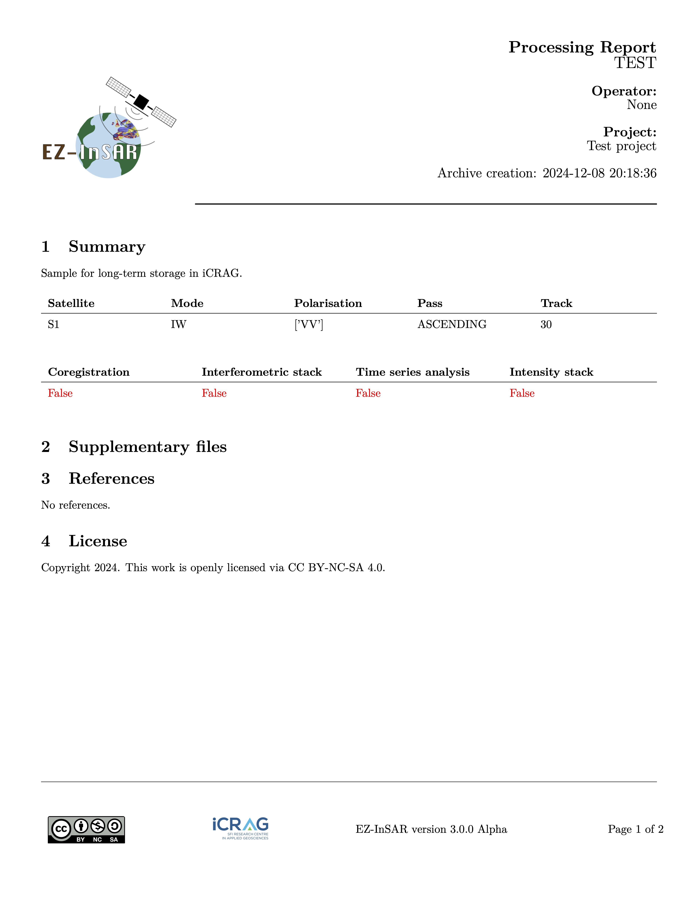

Technical information
=====================

Parameters
----------

**EZ-InSAR** processing job works with two levels of parameters: 

* the **super parameters**, i.e., 

    .. code:: python 

        job.coregistration.mlran = 5 # Multilook factor in range
        job.coregistration.mlazi = 5 # Multillok factor in azimut

.. note::

    The EZ-InSAR job contains only **super parameters**. 

* the **processing parameters**, defined by a dictionary. The **EZ-InSAR** sub-job contains super parameters and processing parameters.

    .. code:: python 

        job.ifgstack.ifggeocoding['process']['value'] = True

    Here, *ifgstack* corresponds to the name of the processing job, and *ifggeocoding* is the processing step. *Process* is therefore the name of the parameter. 

.. note::

    **EZ-InSAR** checks the compatabilities of parameters between various **EZ-InSAR** versions:

    * if a **processing parameter** is not still available in **EZ-InSAR**, a warning message will be deplayed; 
    * if a new **processing parameter** is available in **EZ-InSAR** but not in the .ei job file, a default value will be used. 
    * if a **super parameter** is not available in **EZ-InSAR**, a error will be occured;
    * if a **super parameter** is available in **EZ-InSAR** but not in the .ei job file, a default value will be used. 
 
On the SAR/InSAR processor
--------------------------

For Doris
^^^^^^^^^

* Interface: Python (writing of input cards) -> Bash command -> Doris 
* Multi-threading: need to be confirmed
* Parallelisation: Yes
* Graphical-User-Interface integration: Yes
* Testing: for single interferometric computation

For ISCE-2
^^^^^^^^^^

* Interface: Python -> Bash command -> ISCE-2 
* Multi-threading: Yes
* Parallelisation: need to be fully tested
* Graphical-User-Interface integration: Yes
* Testing: Yes

For StaMPS
^^^^^^^^^^

* Interface: Python -> MATLAB engine-> StaMPS
* Multi-threading: Yes
* Parallelisation: Yes
* Graphical-User-Interface integration: under testing
* Testing: Yes

For MintPy
^^^^^^^^^^

* Interface: Python -> Python -> MintPy
* Multi-threading: Yes (see MintPy's docs)
* Parallelisation: Yes (see MintPy's docs)
* Graphical-User-Interface integration: Yes
* Testing: Yes
  
For LiCSBAS
^^^^^^^^^^^

* Interface: Python -> Bash command -> LiCSBAS
* Multi-threading: Yes (see LiCSBAS's docs)
* Parallelisation: Yes (see LiCSBAS's docs)
* Graphical-User-Interface integration: Under testing
* Testing: Yes

For SNAP
^^^^^^^^

.. note:: 

    There are two options for SNAP implementation: 

    1. snappy **but** snappy has several problems with the memory usage.
    2. GPT. 

    **EZ-InSAR** uses GPT but some function parts are compatible with snappy. **We recommend using GPT.** 

* Interface (1): Python with snappy
* Interface (2): Python -> Writing of .xml input card -> gpt -> SNAP
* Multi-threading: Yes
* Parallelisation: No??
* Graphical-User-Interface integration: Under testing
* Testing: No

On the archive creation
-----------------------

SAR/InSAR data generate very large volume of data, which can be issues for backup. Indeed, duplicating data/results can be impossible because of the space storage. **EZ-InSAR** tries to address this challenge by providing a way to "archive" the SAR/InSAR results. 

**The following tables shows the compatibility of this function with SAR/InSAR processors.**

+-----------+----------------+-----------------------+----------------------+
| Processor | Coregistration | Interferometric stack | Time-Series analysis |
+===========+================+=======================+======================+
| **GAMMA** | O              | X                     | X                    |
+-----------+----------------+-----------------------+----------------------+

**Only one argument is required:**

- *file*: an **EZ-InSAR** job. All active sub-jobs will be processed by default. 

**The full list of options is:**

- *description*: Description of the processor/project. The user can write a text in order to descript the work. 
- *project*: Name of the work/project. 
- *imageill*: Image used for illustration in the report. If None is used, a map of the region of interest will be used. 
- *suppfile*: List of supplementary files which need to be added into the archive. 
- *blockreport*: Block the report creation. 
- *logo*: Logo file can be used in the report. 
- *unmasksensible*: Disable the masking of sensible information (i.e., path). 
- *compression*: Define the compression algorithm. 
- *encryption*: Enable the encryption of the archive. 
- *key*: Path of the user **public** key used by the encryption. 
- *bypassuser*: Bypass the user confirmation. 
- *noclean*: Block the removal of temporary files. 

.. code:: bash 

    ezinsar archive -f <EZ-InSAR job file>  # Create the archive

If the archive is encrypted, **EZ-InSAR** should be used to decrypt it. **EZ-InSAR** also proposes a command for this. 

.. code:: bash

    ezinsar archive_decrypt -f <EZ-InSAR archive> -k <key> # Unzip the archive

Only two options are required:

- *file*: The EZ-InSAR encrypted archive.  
- *key*: Path of the user **private** key. 

**The following images shows an example of the archive report.**

Notes on the EZ-InSAR configuration file
----------------------------------------

The .EZInSARconf file includes numerous variables which users can changed to personalise EZ-InSAR. Default values are for Unix systems. It is not required to have a full .EZInSARconf file. 

**username**: The username for the favourite Sentinel-1 server. Default: *username*

**password**: The password for the favourite Sentinel-1 server. Default: *password*

**tokenM2M**: Not used in the current version. 

**cache**: The cache directory of EZ-InSAR, which will be used to store temporary files. Default: *home_dir/.EZInSARcache*

**pathisce2**: The root directory of ISCE-2, containing all the files and directories. Default: */usr/local/bin*

**pathsnappy**: The directory of the snappy wrapper of SNAP, containing the *esa_snappy* directory (e.g., /home/<user>/.snap/snap-python for Linux). Default: */usr/local/bin*

**pathsnapgpt**: The directory of the GPT wrapper of SNAP, containing the *gpt* executable file. Default: */usr/local/bin*

**pathdoris**: The root directory of Doris, containing all the files and directories. Default: */usr/local/bin*

**pathstamps**: The root directory of StaMPS, containing all the files and directories. Default: */usr/local/bin*

**pathlicsbas**: The root directory of LicSBAS, containing all the files and directories. Default: */usr/local/bin*

**pathserverdatabase**: Not used in the current version.

**licenseagreements**: Depreciated.

**ISCE2modesymlink**: Enable the creation of links (instead of to copy and paste) the stacks from ISCE-2. Can be True or False. Default: *True*

**SNAPcachemax**: Max. cache value before cleaning in MB for SNAP. Default: *5000*

**SNAPcacheclean**: Enable the cleaning of the SNAP cache. Can be True or False. Default: *True*

**SNAPwrapper**: SNAP python wrapper. Can be snappy or gpt. Default: *gpt*

**defautprocessor**: Default SAR/InSAR processor used by EZ-InSAR. Default: *isce2*

**S1server**: Default Sentinel-1 server used by EZ-InSAR. Default: *Copernicus*

**loggingmode**: Logging mode of EZ-InSAR. Default: *INFO*

**nameDockerImage**: Name of the Docker image used by EZ-InSA, if Docker is used. Default: *ezinsar*

**wgetlimit**: Mode of the downloading with wget: if *auto*, the bandwidth limit will be variable according day and night hours, if *XXm*, XX must be a number to define the limit in mB/s, the limit will be fixed. Default: *auto*

**wgetlimitmin**: Min. bandwidth limit used by wget mB/s (during the day hours). Default: *12.5m*

**wgetlimitmax**: Max. bandwidth limit used by wget mB/s (during the night hours). Default: *50.0m*

**chunksize**: Chunk size used by the python downloader. Default: *8192*

**SLCdownloader**: Selected downloader for the SLCs. Can be python or wget. Default: *python*

**sleepSLCdownload**: Sleeping ime between two SLC downloading in seconds. Default: *2*
