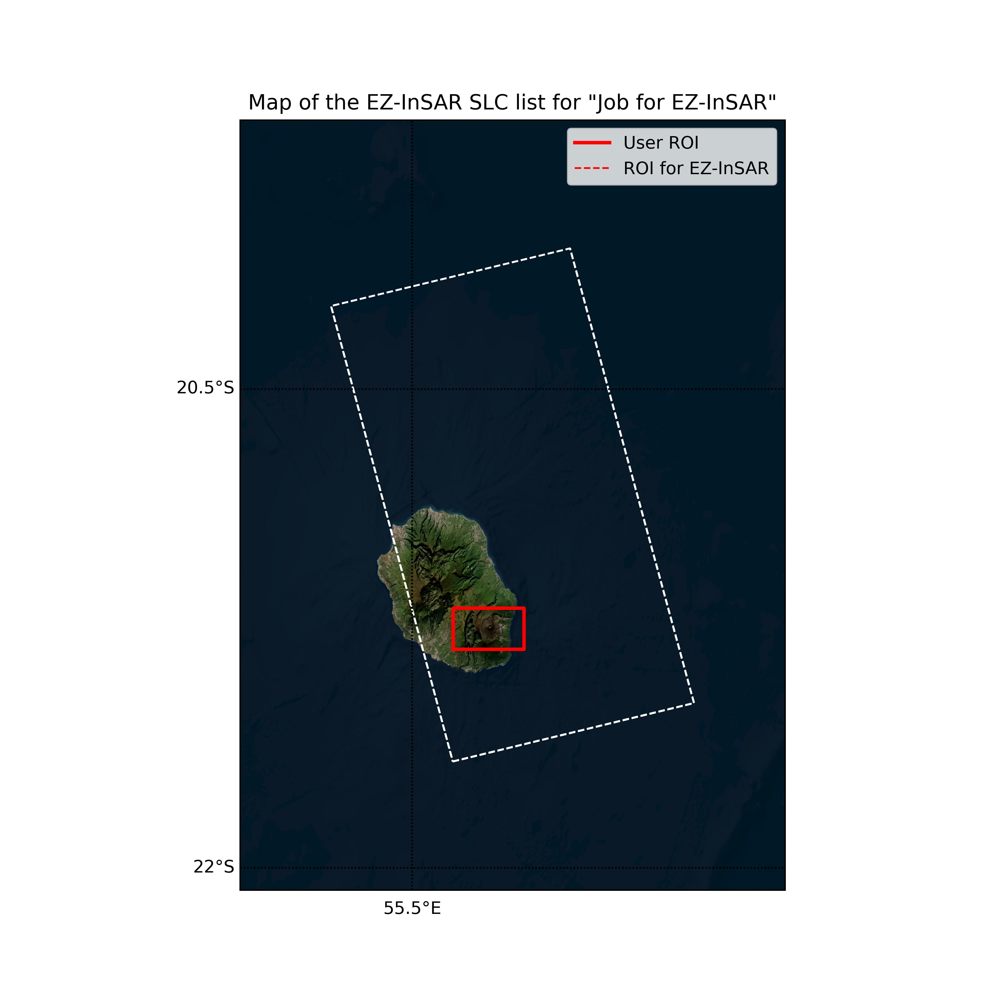
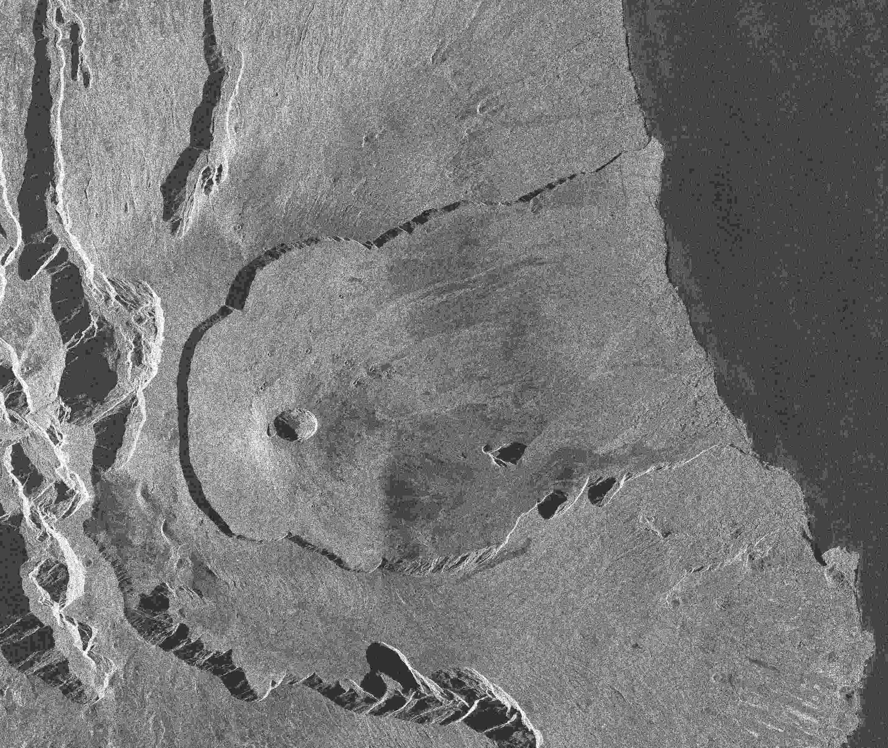
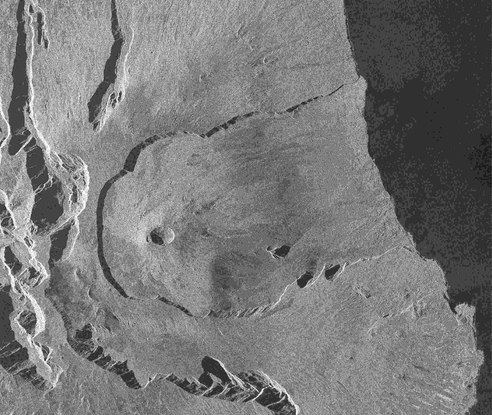
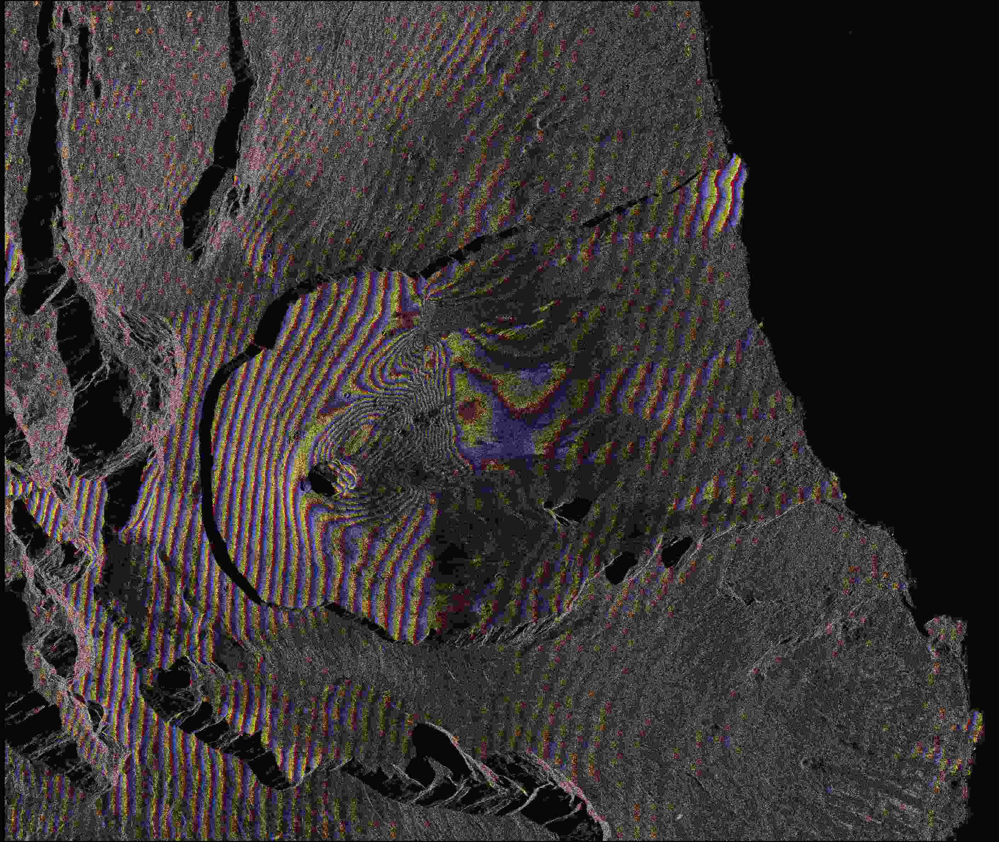
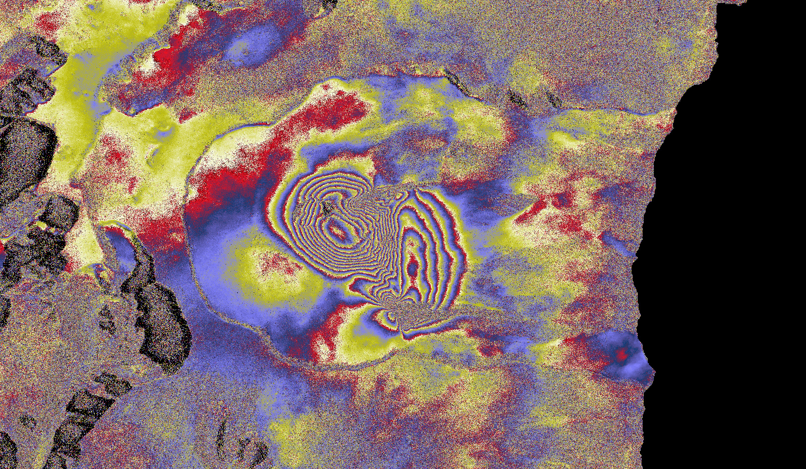
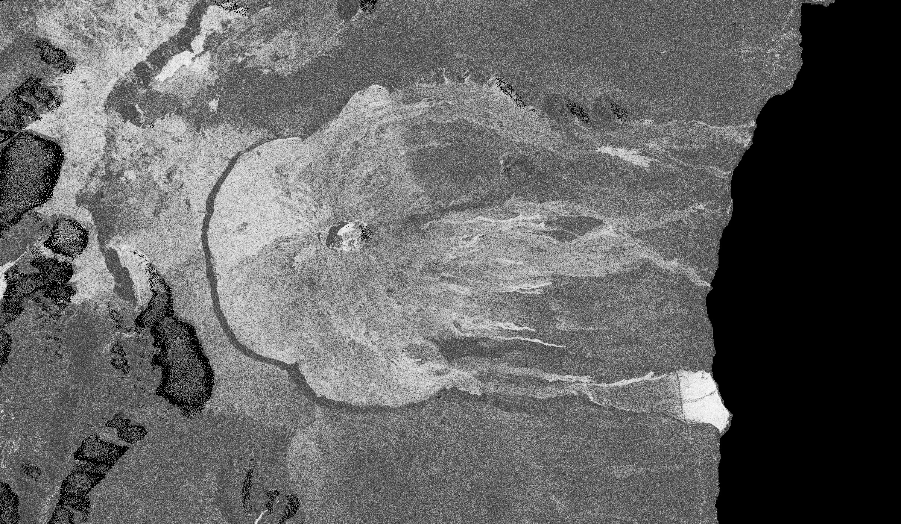

Computation of a Sentinel-1 StripMap single interferogram via CLI of EZ-InSAR
=============================================================================
By Alexis Hrysiewicz, Oct. 2024

Here the goal is the computation of an single interferogram spanning an eruption of the Piton de la Fournaise. We will use Sentinel-1 StripMap data, and the Doris processor. 

Also we will use EZ-InSAR in Python and by command-line interface. 

0 Preparation of EZ-InSAR
--------------------------

**EZ-InSAR** needs to be installed and ready. The Windows' users can used the Docker version of **EZ-InSAR**:

.. code:: bash

   ezinsar docker -v <pathofworkdirectory> 

1 Initialiation of the EZ-InSAR job
------------------------------------

The first step is an initialiation of an EZ-InSAR job. Of course, it is possible to define some parameters: 

* we want to use ONE polarisations available with Sentinel-1 data: **VV**; 
* we decide to use the no-default acquisition mode of Sentinel-1: **SM**; 
* we decide to active the **verbose**; 
* and we also decide to save the log into the *ezinsarexample.log* **file**.

**The Sentinel-1 satellites are selected by default.**

However, we need to modified some parameters: i.e., **the different directory paths and the dates**.

Because this is the easiest option, we can use Python to initialise our job. In your python terminal: 

.. code:: python

   ## Import the required Python packages
   from datetime import datetime 
   import ezinsar.job as ez
   import os

   ## Initialise the job
   job = ez.EIjob(verbose=True,polarisation=['VV'],satmode='SM',log='ezinsarexample.log')

   ## Path directory modofications
   job.workdirectory = os.path.abspath('.')
   job.pathSLC = os.path.abspath('./Data_slc')
   job.pathorbit = os.path.abspath('./Data_orbit')
   job.pathaux = os.path.abspath('./Data_aux')
   job.pathDEM = os.path.abspath('./DEM')

   ## Define the Region of Interest
   job.importroi(input=[55.628551272769705,-21.315123458202194,55.85024829403256,-21.186127122294817])

   ## Date definition 
   job.date1 = datetime.strptime('2023-06-29T00:00:00.000000Z','%Y-%m-%dT%H:%M:%S.%fZ')
   job.date2 = datetime.strptime('2023-07-15T00:00:00.000000Z','%Y-%m-%dT%H:%M:%S.%fZ')

   ## Satellite parameters 
   job.relorbit = 144
   job.satpass = 'ASCENDING'  

   ## Creation of the directories
   job.mkdir()

   ## Quick checking of the job
   job.check()

   ## Initialisation of the SLC list (and print it)
   job.initiateSLC(mode='online',verbose=True)
   job.printSLClist()

   ## Save the job 
   ez.save(job,'example2.ei')

   ## Quit Python 
   quit()

2 Download the Sentinel-1 data (SLC and orbits)
-----------------------------------------------

Even if **EZ-InSAR** offers easy tools for Sentinel-1 downloading, we will use the Python to download the imagery (and the orbit files), because we will use some advanced options of **EZ-InSAR** to download only the VV polarisation of Sentinel-1 data. This option is only compatible with the Copernicus server. 

.. code:: python

   import ezinsar.job as ez

   job = ez.load('example2.ei')

   job.downloadSLC(username='xxxxxxx',password="xxxxxxx",partialdownloading=['-vh-'],modepartial='exclude',zipping=False)
   job.downloadorbit(username='xxxxxxx',password="xxxxxxx")
   job.checkSLClist()
   job.displaySLClist(figure='fig1_example2.jpg')

   ez.save(job,'example2.ei')

   quit()

Map generated by **EZ-InSAR** regarding the SLC extents and the ROI. 

3 Download the DEM
------------------

Since this step, we will use the command-line interface of **EZ-InSAR**. Here the goal is to download the DEM. 

.. code:: bash 

   ezinsar DEM -s example2.ei -b 0,0,0,0 --typeDEM Copernicus-ell --processor doris

4 Coregistration
----------------

After the DEM retrieval, **EZ-InSAR** is ready to run the coregistration. Firstly, we need to add the coregistration job: 

.. code:: bash 

   ezinsar init -p doris -t coreg -f example2.ei -j example2.ei

All default parameters are correct, we therefore can run the processing: 

.. code:: bash 

   ezinsar run -f example2.ei -s 1-14

Some images can be verified to make sure that the coregistration was correct. 

The master image: 

The slave image (before the coregistration):

The interferogram without any correction: 

5 Interferometric computation
-----------------------------

From the coregistred stack, we are now able to run the interferometric computation. Again, we need to add the ifgstack job: 

.. code:: bash 

   ezinsar init -p doris -t ifgstack -f example2.ei -j example2.ei

Some parameters need to be changed. Here we desire to increase the resolution of geotiff InSAR products (final images) by modifying the oversampling factor of the DEM. This can be done because of the StripMap data. 

.. code:: bash 

   ezinsar init -t ifgstack -f example2.ei -j example2.ei --modify 'ifggeocoding["overlon"]["value"]=3.0'
   ezinsar init -t ifgstack -f example2.ei -j example2.ei --modify 'ifggeocoding["overlat"]["value"]=3.0'

Finally, we are ready for the processing. **Be carefully, we have to select the ifgstack job.**

.. code:: bash 

   ezinsar run -f example2.ei -s 1-8

The result images can be found in the geotiff directory. 

The filtered interferogram: 

The coherence:

