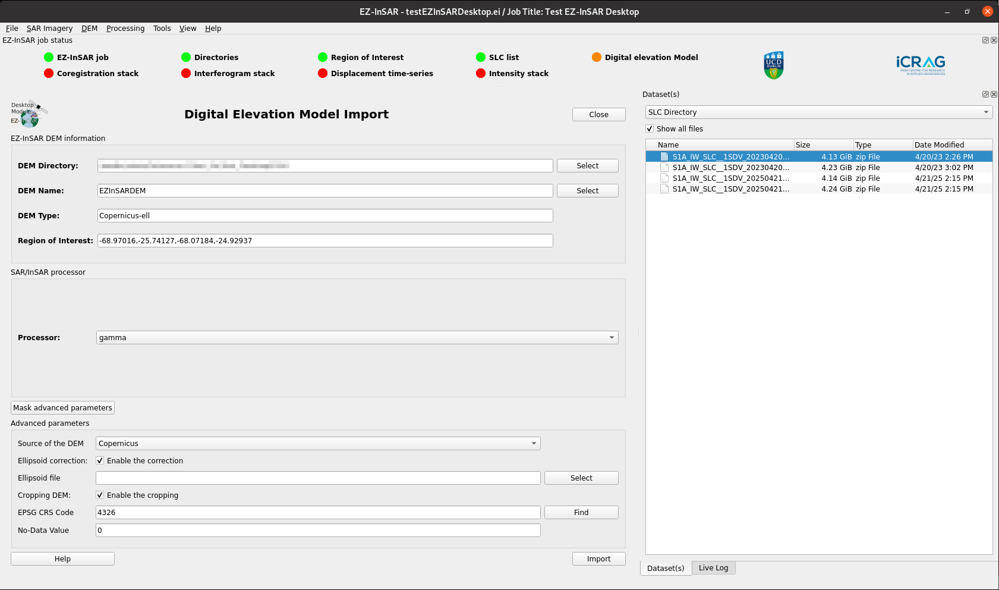

Import a DEM
============

.. note::

  The EZ-InSAR command to directory open the tool without the full application is:

  .. code:: bash

    ezinsar desktop DEM -f <EZ-InSAR job file>

.. admonition:: DEM / Processor
  :class: danger

  The processing needs to be selected here. 

**Go to DEM -> Import** in order to import the DEM. This tool offers all tools and parameters to download DEMs. 

**Import** button will run the import and apply the correction requested by users. 

  DEM tool of EZ-InSAR. The layout may differ slightly depending on your version. 
   
