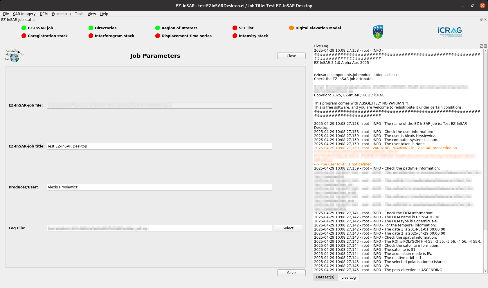
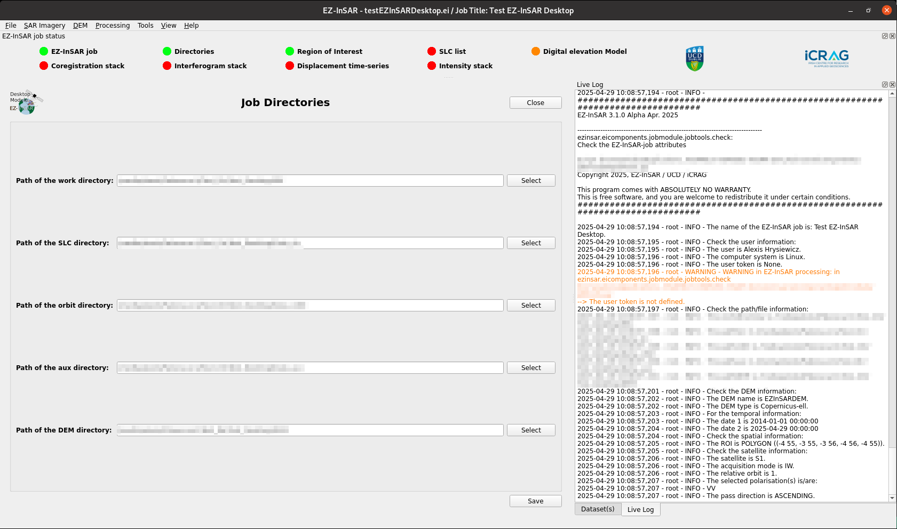

Modification of the job parameters and directories
==================================================

For the job parameters
----------------------

.. note::

   The EZ-InSAR command to directory open the tool without the full application is:

   .. code:: bash

      ezinsar desktop parameter -f <EZ-InSAR job file>

**Go to File -> Parameters** in order to modify the job parameters. 

   Job parameter tool of EZ-InSAR. The layout may differ slightly depending on your version. 

For the job directories
-----------------------

.. note::

   The EZ-InSAR command to directory open the tool without the full application is:

   .. code:: bash

      ezinsar desktop directory -f <EZ-InSAR job file>

**Go to File -> Directory -> Change** in order to change the job directories. 

   Job directory tool of EZ-InSAR. The layout may differ slightly depending on your version. 

.. note:: 

   If the directories do not exist, **Go to File -> Directory -> Create**