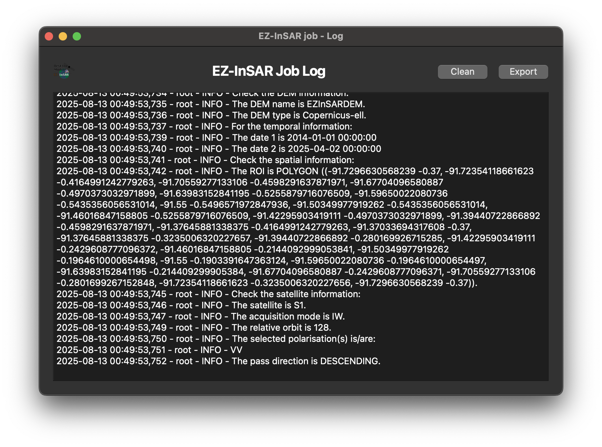

Open the log of the current EZ-InSAR job
========================================

.. note::

   The EZ-InSAR command to directory open the tool without the full application is:

   .. code:: bash

      ezinsar desktop log -f <EZ-InSAR job file>

**Go to File -> Log** in order to open the log of the current EZ-InSAR job. 

   Log tool of EZ-InSAR. The layout may differ slightly depending on your version. 

There are two buttons available:

* *Clear* will clean the log; 
  
* *Export* will export the log to a selected location. 