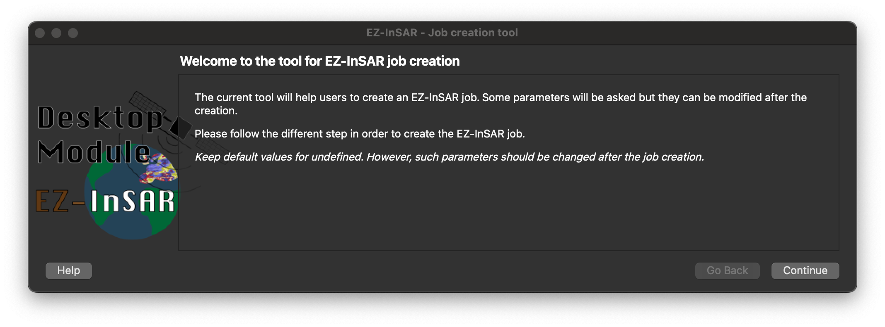
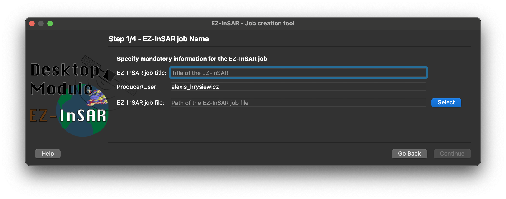
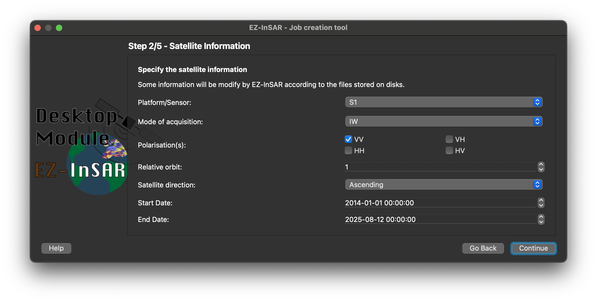
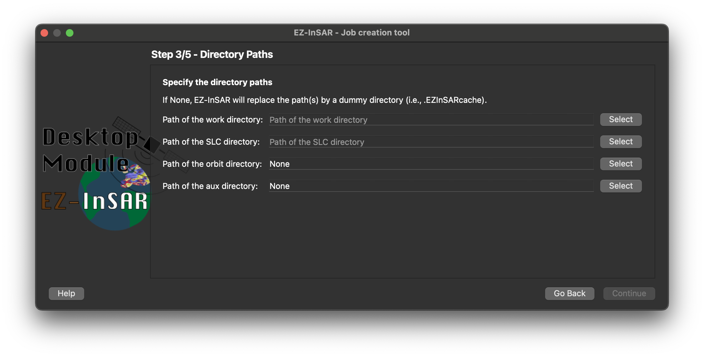
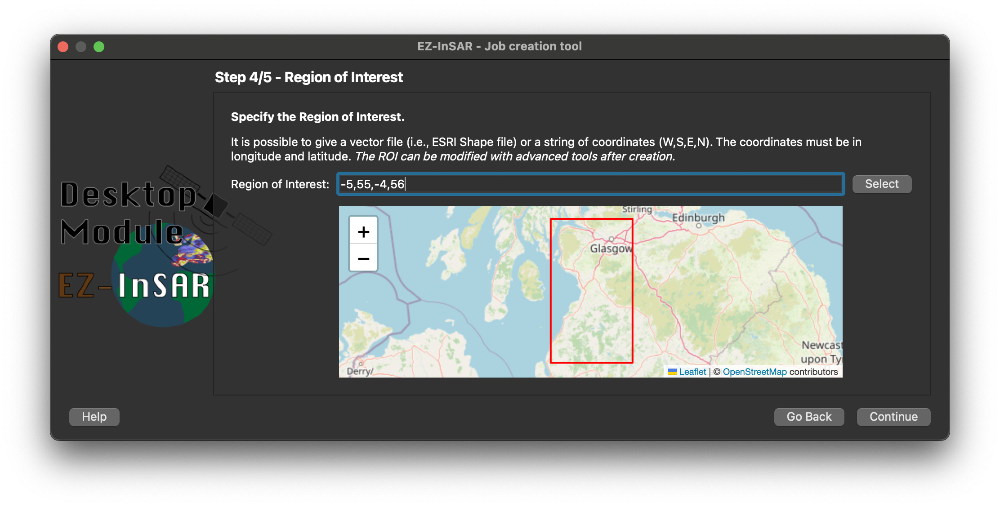
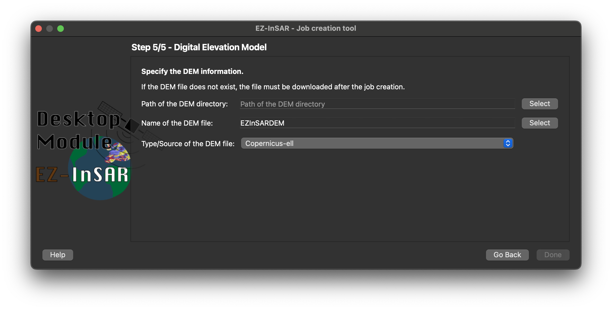

Create a new EZ-InSAR job
=========================

EZ-InSAR includes a tool to create an EZ-InSAR. **Go to File -> New**. 

.. note::

   The EZ-InSAR command to directory open the tool without the full application is:

   .. code:: bash

      ezinsar desktop create

.. note::

   All information can be modified later.

Introduction
------------

The first wizard page is a simple introduction. **Go to Next**.
 

   EZ-InSAR job creation tool (Page 0 of 5). The layout may differ slightly depending on your version. 

EZ-InSAR job information
------------------------

The second page allows to define the main information of the job:

* the title;

* the producer name; 

* the path of the EZ-InSAR job file. 
 

   EZ-InSAR job creation tool (Page 1 of 5). The layout may differ slightly depending on your version. 

After filling in the information, **Go to Next**.

Satellite information
---------------------

The 3rd page allows to define the information regarding the satellite. As the other pages, these information can be modified later. If the images are already stored on disks, EZ-InSAR will modify the information automatically.  
 

   EZ-InSAR job creation tool (Page 2 of 5). The layout may differ slightly depending on your version. 

After filling in the information, **Go to Next**.

Job directories
---------------

The 4st page allows to define the directories used by EZ-InSAR. 
 

   EZ-InSAR job creation tool (Page 3 of 5). The layout may differ slightly depending on your version. 

After filling in the information, **Go to Next**.

Region of interest
------------------

The 5st page allows the selection of the region of interest. Coordinates <S,W,N,E> or a vector file (i.e., shapefile) can be given. 
 

   EZ-InSAR job creation tool (Page 4 of 5). The layout may differ slightly depending on your version. 

After filling in the information, **Go to Next**.

Digital Elevation Model
-----------------------

The 5st page allows to define some preliminary information about the used DEM.
 

   EZ-InSAR job creation tool (Page 5 of 5). The layout may differ slightly depending on your version. 

After filling in the information, **Go to Done**. **The job file will be generate and stored.**