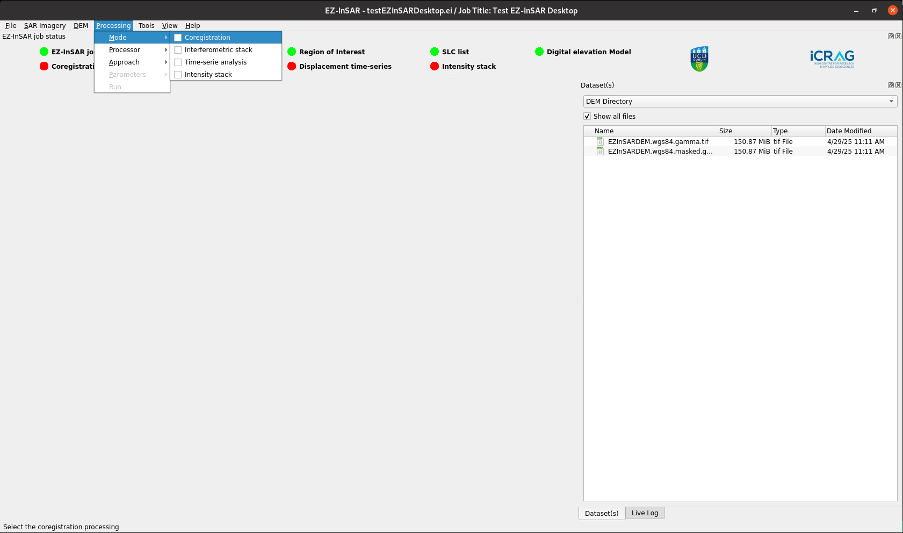

Initiate and change the processing type
=======================================

.. note::

  The EZ-InSAR command to directory open the tool without the full application is:

  .. code:: bash

    ezinsar desktop initprocess -f <EZ-InSAR job file> -m <processing mode>

In the menu bar named **Processing**, users can initiate/change the processing mode, the processors (and the approach for time-series analysis):

* **Go to Processing -> Mode**: to change the processing mode. 

* **Go to Processing -> Processor**: to change the processor. 
  
* **Go to Processing -> Approach**: to change the approach. It only is available for time-series analysis processing.  

  The layout may differ slightly depending on your version. 

.. admonition:: Modification
  :class: danger

  To modify these parameters will reset the processing parameters.
   
