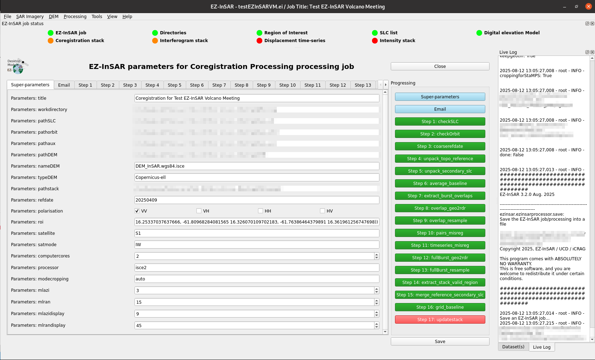

Manage the processing parameters
================================

Modify the processing parameters
--------------------------------

.. note::

  The EZ-InSAR command to directory open the tool without the full application is:

  .. code:: bash

    ezinsar desktop parameterprocess -f <EZ-InSAR job file> -m <processing mode>

**Go to Processing -> Parameters -> Modify** in order to open the application.

The application offers a full control of processing parameters, classified according to the processing steps.

  Processing parameter tool of EZ-InSAR. The layout may differ slightly depending on your version. 
   
Check the processing parameters
--------------------------------

**Go to Processing -> Parameters -> Check** in order to check the processing parameters.

Import the processing parameters
--------------------------------

**Go to Processing -> Parameters -> Import** in order to import the processing parameters from an EZ-InSAR processing job. 

Export the processing parameters
--------------------------------

**Go to Processing -> Parameters -> Import** in order to export the processing parameters into an EZ-InSAR processing job. 

Reset the processing parameters
-------------------------------

**Go to Processing -> Parameters -> Reset** in order to reset the processing parameters. 
