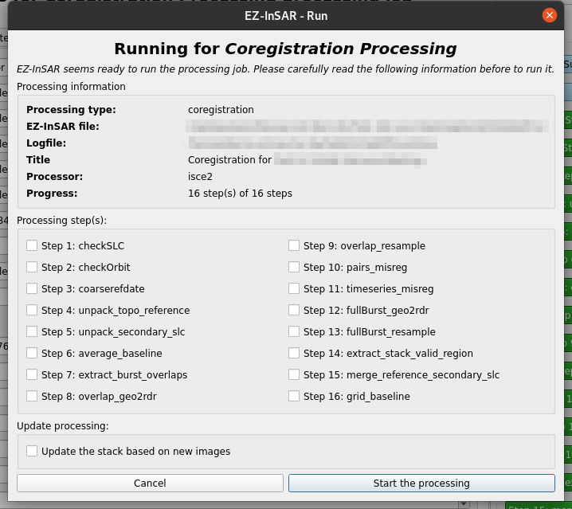

Run an EZ-InSAR processing
==========================

.. note::

  The EZ-InSAR command to directory open the tool without the full application is:

  .. code:: bash

    ezinsar desktop run -f <EZ-InSAR job file> -m <processing mode>

**Go to Processing -> Run** in order to open the application.

This window will be the last window displayed before running a processing. Some information about the processing are displayed (i.e., title, processor, progress, etc.) and the processing steps can be selected. 

  Processing run tool of EZ-InSAR. The layout may differ slightly depending on your version. 
