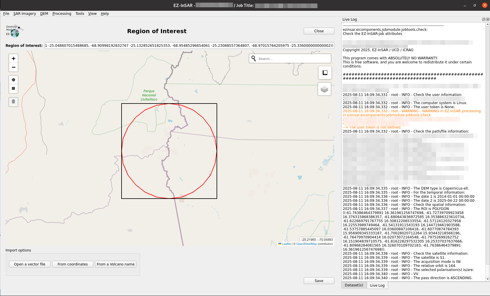

Selection of the region of interest
===================================

.. note::

  The EZ-InSAR command to directory open the tool without the full application is:

  .. code:: bash

    ezinsar desktop roi -f <EZ-InSAR job file>

**Go to File -> Region of Interest** in order to open the region-of-interest application.

EZ-InSAR offers three ways to define the region of interest: 

* by interacting with the map. **Do no forget to click on the shape to validate the selection.**

* by importing a vector files: e.g., a shapefile; 

* by giving coordinates in <W,S,E,N> format; 

* by opening the *Volcano Finder*. 

Then, the new ROI can be **Saved**.

  ROI tool of EZ-InSAR. The layout may differ slightly depending on your version. 

  
   

