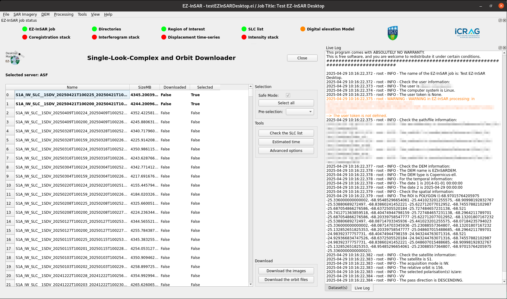

Download the SAR products
=========================

.. note::

  The EZ-InSAR command to directory open the tool without the full application is:

  .. code:: bash

    ezinsar desktop downloader -f <EZ-InSAR job file>

**Go to SAR Imagery -> Downloader** in order to open the application.

If the SAR imagery is retrieved from online repositories, the Downloadere application allows to download SLCs and orbit files. 

.. note:: 

  The server used from imagery retrieval cannot be changed at this stage. 

Each images can be selected for downloading by clicking on the list. The application will checked that data are completed if several frames are needed. Options are available:

* advanced options according to the server used; 

* verification of the SLC list; 

* estimatations of the downloading time; 

* several pre-defined mode of selection (i.e., monthly, etc.). 

when the *Download the images* is clicked, the application will request username and password, however these values can be loaded from the configuration file of EZ-InSAR. 

when the *Download the orbit files* is clicked, the application will request username and password, however these values can be loaded from the configuration file of EZ-InSAR. In addition, the server can be selected. 

  Downloader tool of EZ-InSAR. The layout may differ slightly depending on your version. 

  
   

