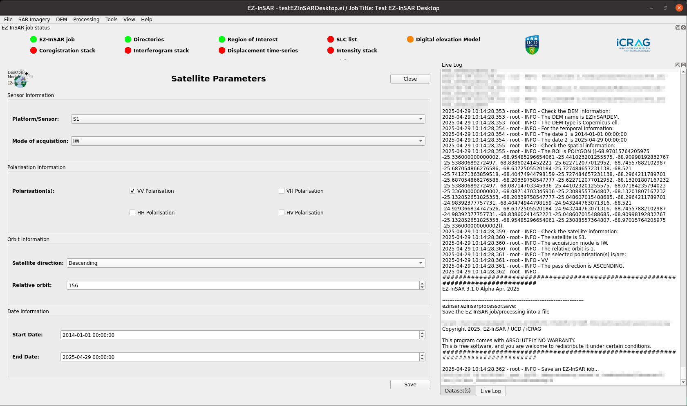

Change the satellite parameters
===============================

.. note::

  The EZ-InSAR command to directory open the tool without the full application is:

  .. code:: bash

    ezinsar desktop satparameter -f <EZ-InSAR job file>

**Go to SAR Imagery -> Parameters** in order to open the associated application.

Via the interface, all required satellite parameters can be modified. However, they can be automatically changed based on the SLC images stored on disks. 

  Satellite parameter tool of EZ-InSAR. The layout may differ slightly depending on your version. 

Then, **Save**.

  
   

