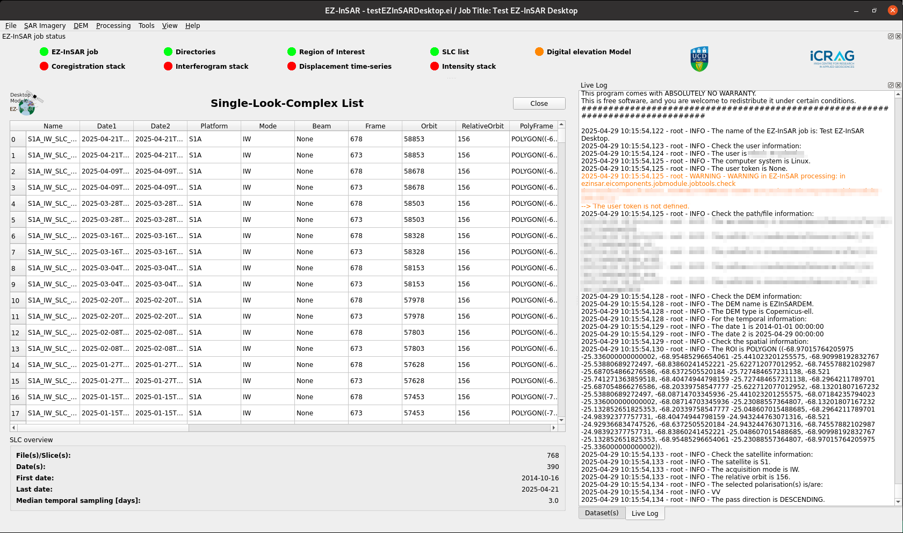
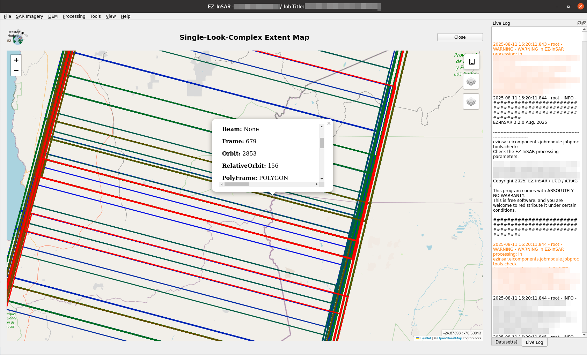

Manage SAR imagery via the SLC list
===================================

Create the SLC list
-------------------

EZ-InSAR can generate the SLC list based on three methods: 

* from online-stored imagery: **Go to SAR Imagery -> Single-look-complex list -> Retrieve -> Based on online imagery** 

* from files stored on local disks: **Go to SAR Imagery -> Single-look-complex list -> Retrieve -> Based on local imagery** 

* from an imported EZ-InSAR SLC list (in .csv format): **Go to SAR Imagery -> Single-look-complex list -> Retrieve -> Based on an EZ-InSAR SLC list**

.. note:: 

  EZ-InSAR will check the SLC list and modify the satellite parameters according to the images used. 

Check the SLC list
-------------------

**Go to SAR Imagery -> Single-look-complex list -> Check the SLC list** in order to check the SLC list (e.g., consistency).

Display the SLC list
--------------------

.. note::

  The EZ-InSAR command to directory open the tool without the full application is:

  .. code:: bash

    ezinsar desktop SLClist -f <EZ-InSAR job file>

**Go to SAR Imagery -> Single-look-complex list -> Open the table** in order to the application.

  SLC-list tool of EZ-InSAR. The layout may differ slightly depending on your version. 

All information available in the SLC list are displayed in the table. Some supplemetary information (first date, last date, average sampling) are also available. 

Open the map of the SLC extents
-------------------------------

.. note::

  The EZ-InSAR command to directory open the tool without the full application is:

  .. code:: bash

    ezinsar desktop SLCmap -f <EZ-InSAR job file>

**Go to SAR Imagery -> Single-look-complex list -> Display the SLC extents** in order to the application.

  SLC-list tool of EZ-InSAR. The layout may differ slightly depending on your version. 

Export the SLC list 
-------------------

EZ-InSAR can export the SLC list into two formats: 

* .csv. This format can be imported into EZ-InSAR; 

* .kmz. 

**Go to SAR Imagery -> Single-look-complex list -> Export** 
