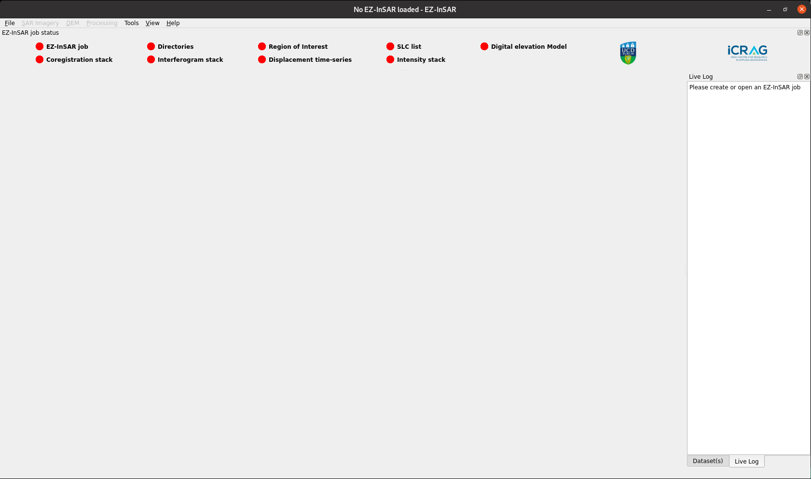
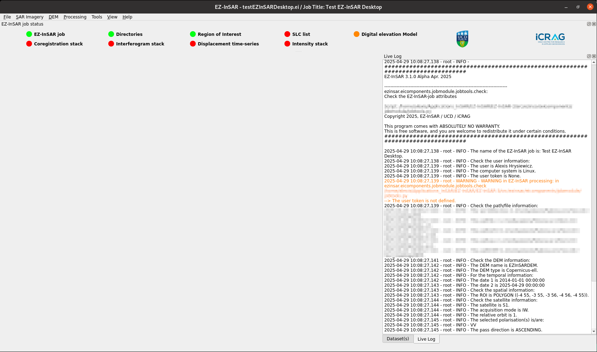

The main window of EZ-InSAR Desktop
===================================

The structure of EZ-InSAR Desktop
---------------------------------

The main window of EZ-InSAR includes several parts: 

* the main space where the tools/applications will be displayed; 

* the menu bar for quick access; 

* several docks (log, datasets, status of the processing, etc.):

   * *at the top:* the status dock gives an overview of the processing (red for not started; orange for in progress; green for done); 

   * *at the right:* 
  
      * the **live log** dock return the log/verbose of EZ-InSAR; 
      
      * the **dataset** dock displays the files available on the working directories. Files can be displayed by clicking on their names;

      * the **system monitor** dock (hidden by default) gives information on the computer. 

   Main window of EZ-InSAR Graphical User Interface. The layout may differ slightly depending on your version. 

The main window with a job loaded
---------------------------------

Since a job is loaded, EZ-InSAR detects the current processing, unlock the applications (i.e., the menu bar) and update the live log.   

   Main window of EZ-InSAR Graphical User Interface with a job loaded. The layout may differ slightly depending on your version. 
