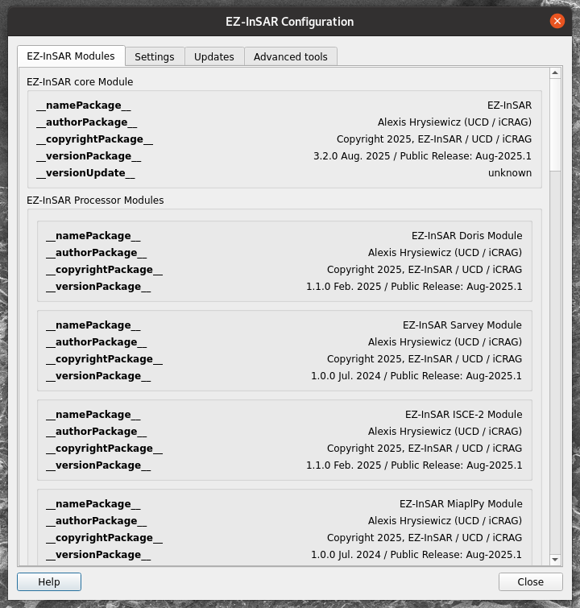
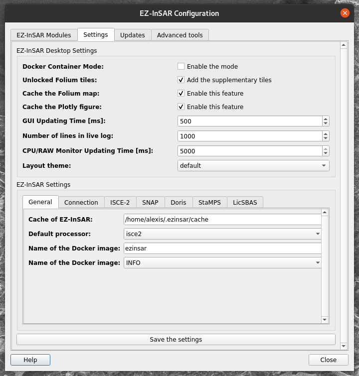
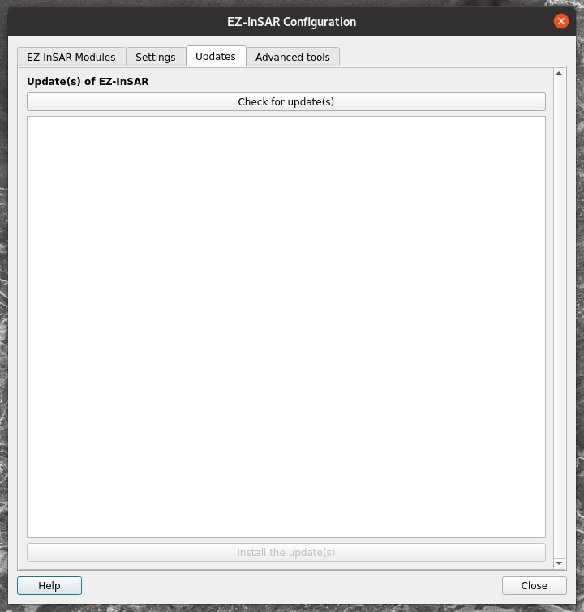
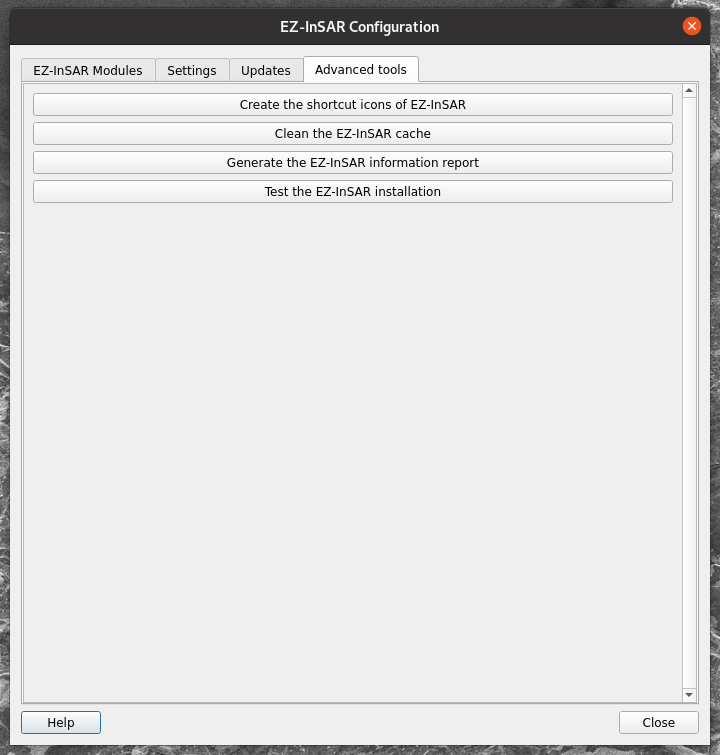

Configure EZ-InSAR Desktop Module
=================================

.. note::

  The EZ-InSAR command to directory open the tool without the full application is:

  .. code:: bash

    ezinsar desktop config -f <EZ-InSAR job file> -m <processing mode>

**Go to Help -> Settings** (or Preferences on MacOS) in order to open the application. 

The Configuration application has four tabs:

* *EZ-InSAR Module* tab: an overview of the EZ-InSAR installation; 

* *Settings* tab: parameters of EZ-InSAR Desktop;

* *Updates*: the updating features of EZ-InSAR; 

* *Advanced tools*: some other tools. 

EZ-InSAR Module tab
-------------------

This tab allows to have an overview of the EZ-InSAR installation: i.e.,:

* list of installed EZ-InSAR modules; 

* information of the modules (version, etc.). 

  Configuration (1/4) tool of EZ-InSAR. The layout may differ slightly depending on your version. 

Settings tab
------------

This tab can be used to modify the settings of:

* EZ-InSAR Desktop Module (top part); 

* EZ-InSAR (buttom part); . 

  Configuration (2/4) tool of EZ-InSAR. The layout may differ slightly depending on your version. 

.. admonition:: Settings
  :class: danger

  If a setting is modified, EZ-InSAR will be rebooted. 

Updates tab
-----------

.. admonition:: Updates
  :class: danger

  This feature will be implemented in a next version of EZ-InSAR. 

  Configuration (3/4) tool of EZ-InSAR. The layout may differ slightly depending on your version. 

Advanced tools tab
------------------

The last tab gives some tools regarding the EZ-InSAR environment. 

  Configuration (4/4) tool of EZ-InSAR. The layout may differ slightly depending on your version. 

Other tools regarding the EZ-InSAR environment
==============================================

Open the license files
----------------------

**Go to Help -> Licenses** in order to open the application regarding the license files. 

Open the documentation
----------------------

.. note::

  The EZ-InSAR command to directory open the tool without the full application is:

  .. code:: bash

    ezinsar desktop docs [-m <ezinsar module>]

The application allows to open the documentation of EZ-InSAR. However, it is accessible from **Go to Help -> Documentation**.

Open the About dialog
---------------------

.. note::

  The EZ-InSAR command to directory open the tool without the full application is:

  .. code:: bash

    ezinsar desktop about

The application allows to open the documentation of EZ-InSAR. However, it is accessible from **Go to Help -> About**.

