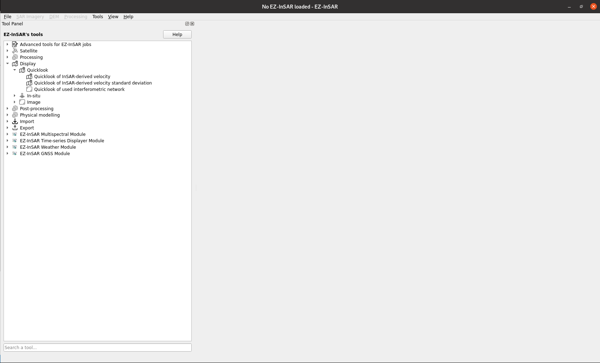

EZ-InSAR's tools
================

**Go to Tool -> Tool panel** in order to active the tool dock. Here the EZ-InSAR's tools can be open. The tools are order by topic. 

  Tool panel of EZ-InSAR. The layout may differ slightly depending on your version. 

.. note:: 

    The search bar can be used to easily find a tool. 

.. toctree::
    :maxdepth: 1
    :caption: List of available EZ-InSAR's tools

    tool1