BWLava: InSAR coherence-based lava-flow outlines
================================================

.. image:: https://img.shields.io/badge/MATLAB-blue

.. admonition:: Warning
  :class: warning

  **BWLava** is under development and tests. Some bugs and uncomplete scripts/functions can be found.

  **BWLava** is a part of **EZ-InSAR** and cannot be redistributed outside the **EZ-InSAR** Python package. 

BWLava is a short application to extract the lava-flow outlines from InSAR coherence images. It uses the contrast between lava flows (low InSAR coherence) and background (high InSAR coherence). 

References
----------

* Alexis Hrysiewicz. InSAR characterisation of lava-flow displacements at Piton de la Fournaise. Université  Clermont Auvergne, 2019. French. 

* Andrew J.L. Harris, Magdalena Oryaëlle Chevrel, Diego Coppola,  Michael Ramsey, Alexis Hrysiewicz, et al.. Validation of an integrated  satellite-data-driven response to an effusive crisis: the April-May 2018 eruption of Piton de la Fournaise. Annals of Geophysics, Istituto  Nazionale di Geofisica e Vulcanologia (INGV), 2019, 61 (Vol 61 (2018)),  ⟨10.4401/ag-7972⟩. ⟨hal-02150627⟩

Installation
------------

No particular installation is required. However, the MATLAB functions for ENVI files can be required, please download these scripts from https://fr.mathworks.com/matlabcentral/fileexchange/27172-envi-file-reader-writer into the 3rd party directory. 

Use
---

Opening
^^^^^^^

BWLava can be directly opened from **EZ-InSAR**: 

.. code:: bash 

    ezinsar program BWLava

or from a MATLAB terminal (according to the current directory contains the scripts): 

.. code:: matlab 

    BWLava

Main menu
^^^^^^^^^

After opening the application, the main menu of BWLava is be displayed. 

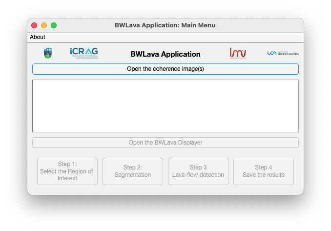

After the selection of InSAR coherence images, the data table will be updated and displayed. Multiple selection is possible. The processing therefore will be the same for all selected coherence images. 

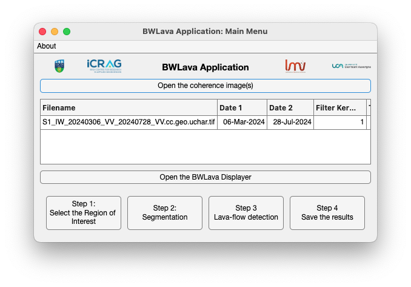

The user should be able to open the BWLava Displayer by clicking of the button *Open the BWLava Displayer*. 

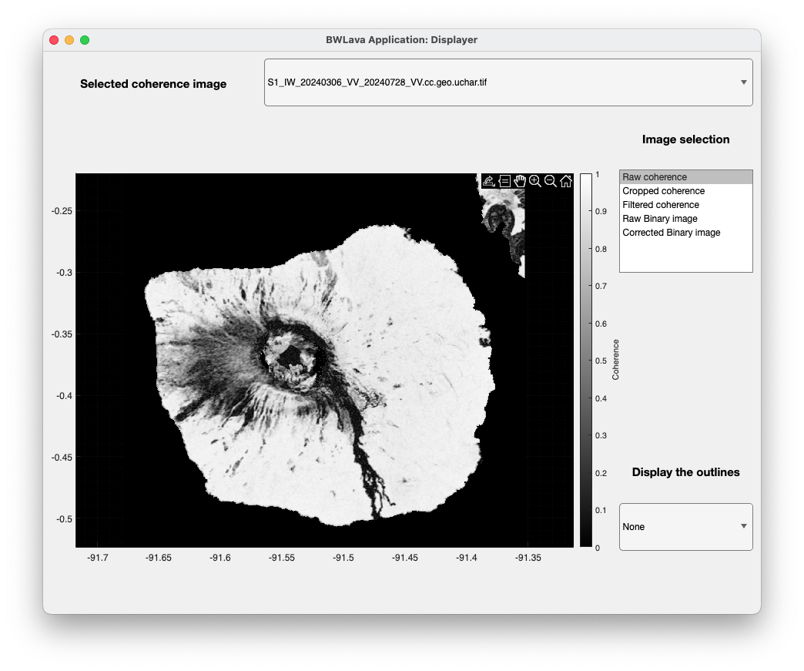

The Displayer is the main part of the appliction. Indeed, all interactions will be carried out from this windows. The user can change the displayed images by using the dropdown list, and see the different results. 

Definition of the Region of Interest
^^^^^^^^^^^^^^^^^^^^^^^^^^^^^^^^^^^^

The first step is the definition of the Region of Interest. Using the button *Step 1*. The user will be able to trace the desired ROI. Double-click is required to valide the ROI. 

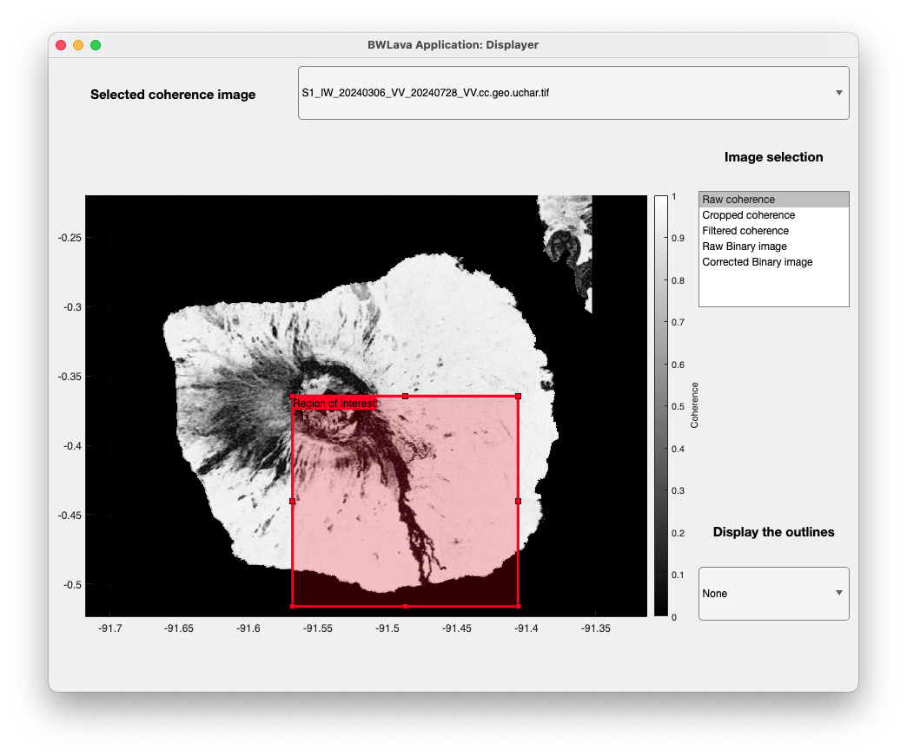

Selection of the Region of Interest for segmentation
^^^^^^^^^^^^^^^^^^^^^^^^^^^^^^^^^^^^^^^^^^^^^^^^^^^^

As the definition of the Region of Intersect, the user should define another ROI for the segmentation. 

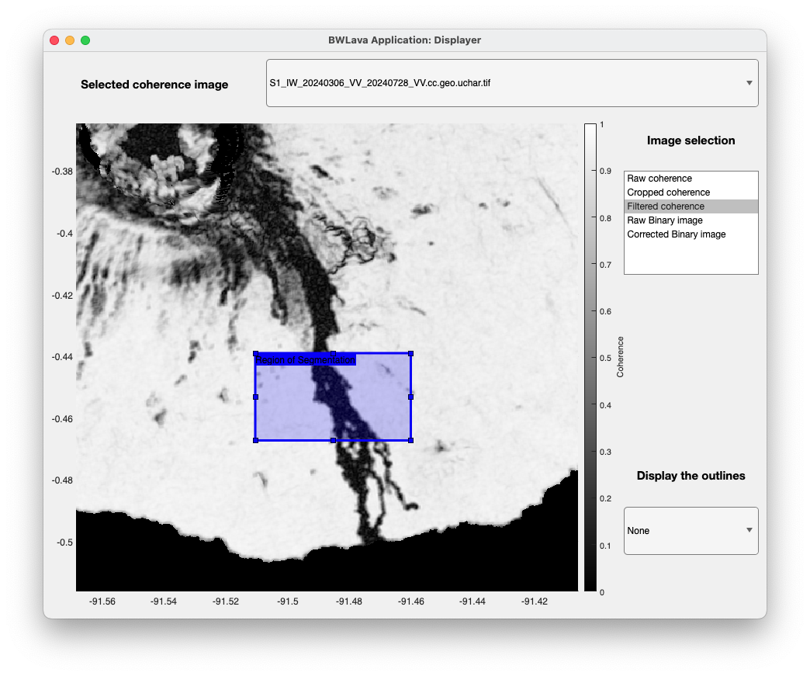

The threshold value is now in the data table of the main menu. In addition, this cell is modifiable if the user wants to define the threshold value. From this process, the initial mask will be produced. 

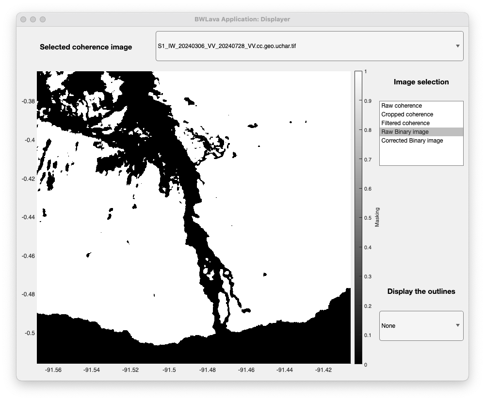

Unfortunately, this mask requires some post-processing, that will be done with the next steps. 

Lava-flow detection
^^^^^^^^^^^^^^^^^^^

By clicking on the third button of the main menu, the Lava Detector will be opened. This window contains all tools to define the lava-flow parts, and masks in order to post-process the initial mask. A enhanced post-processing can be also enabled in the Lava-Detector window. At the minimun, one lava-flow part requires to be defined. 

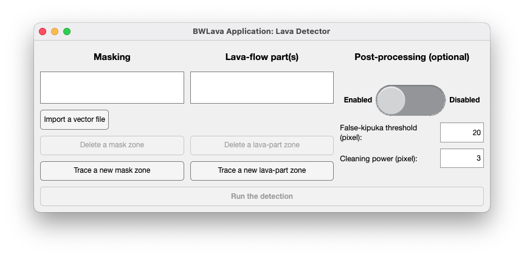

By interaction with the BWLava Displayer, the user can easily defined the polygons for the lava-flow parts and masks. The BWLava displayer will show all defined polygons. 

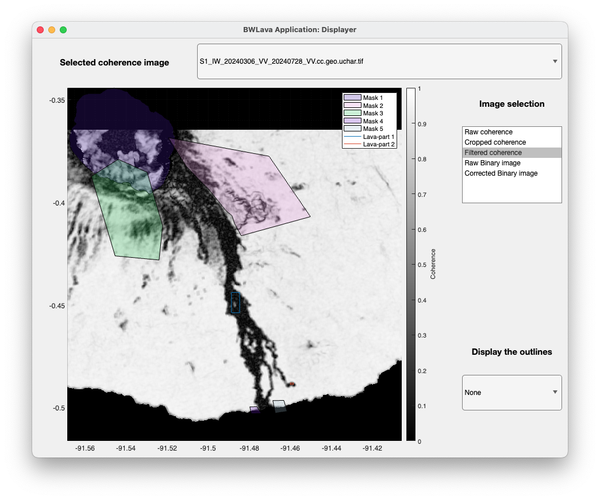

After clicking on the "Computation" button, the BWLava displayer will show the post-processed mask. 

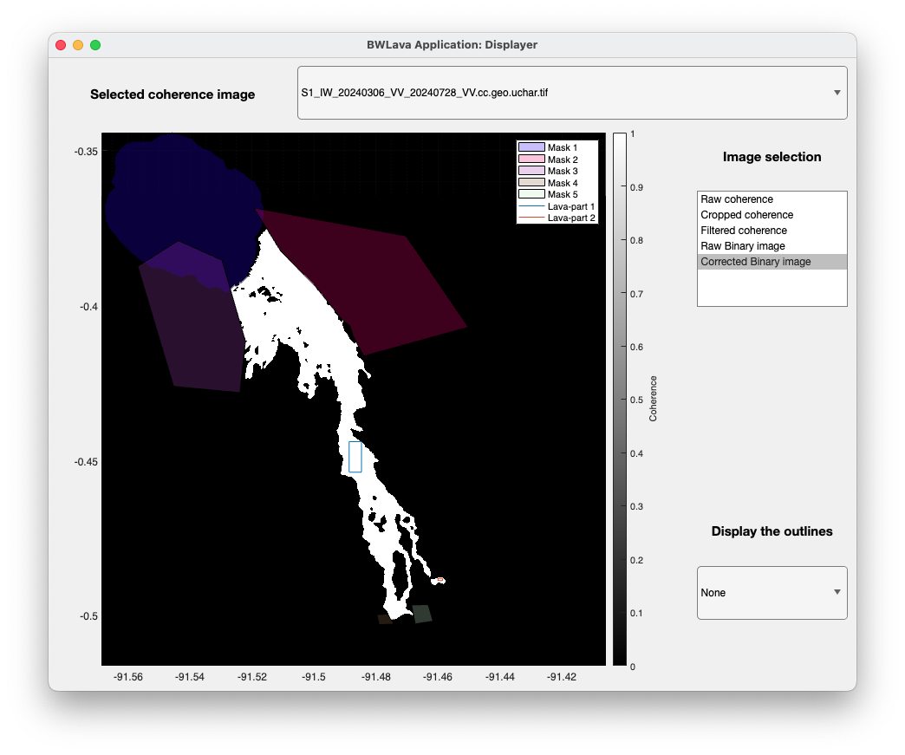

At this stage, the user will be able to close the Lava Detector and display the lava-flow outlines by using the dropdown list in the BWLava Displayer. 

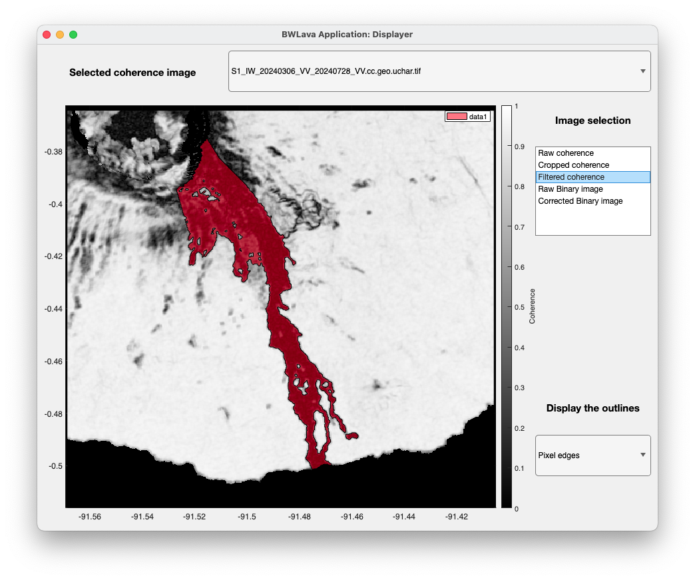

Save the results
^^^^^^^^^^^^^^^^

Finally, the last button of the main menu named *Step 4 Save the results* can be used to save the results. 

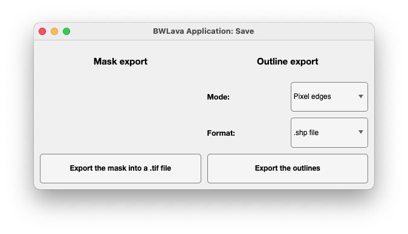

Two products can be exported: 

* the lava-flow mask in GeoTIFF format; 
* the lava-flow outlines (pixel centres or edges). 
